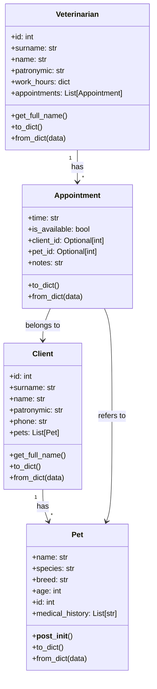

## Львівський Національний Університет Природокористування
## Кафедра Інформаційних систем та Технологій

### Звіт про виконання лабораторної роботи №11
# "Твірні шаблони проектування"

| **Виконав: студент групи ІТ-31 Юрій Мавко**  |
|----------------------------------------------|
| **Перевірив: Татомир А. В.**                 |

**Мета: познайомитися з групою твірних шаблонів проєктування.**

Завдання

1. Дати теоретичний опис твірної групи шаблонів.
2. Відповідно до индивідуального завдання:
- дати теоретичний опис даного шаблону;
- навести приклад коду який реалізовує даний шаблон;
- скласти його UML-діаграму.

**Опис твірної групи шаблонів**

Твірна група шаблонів включає шаблони, що відповідають
за створення об'єктів в програмному забезпеченні. 
Основне завдання цієї групи полягає в тому, щоб ізолювати 
процес створення об'єктів від решти коду, що дозволяє 
зробити систему більш гнучкою та легко розширюваною. 
Ці шаблони пропонують різні механізми для контролю 
створення об'єктів, забезпечуючи при цьому можливість 
контролювати їхнє використання та ініціалізацію. Твірні
шаблони дозволяють спростити та оптимізувати процес 
створення об'єктів, надаючи гнучкість у виборі механізму
інстаціювання класів, що робить систему легше масштабованою
та змінюваною.

Шаблон проектування Builder - породжувальний патерн проектування, 
що дає змогу створювати складні об'єкти крок за кроком. Він 
дозволяє використовувати один і той самий код будівництва для 
отримання різних відображень об'єктів. Тобто builder шаблон за 
допомогоюякого можна крок за кроком створювати складні об'єкти 
різних конфігурацій.

**Опис коду**

Код реалізує патерн Builder для створення комп'ютерів різних типів. 
Є два основні типи комп'ютерів: ігровий з потужними характеристиками 
та офісний з простішими компонентами.

Клас **Computer** представляє комп'ютер із трьома характеристиками: 
процесором, відеокартою та оперативною пам'яттю. Є метод для виведення 
інформації про комп'ютер у зручному форматі.

Інтерфейс **ComputerBuilder** визначає методи для налаштування 
компонентів комп'ютера: set_cpu, set_gpu, set_ram, а також метод reset 
для скидання конфігурації.

**GamingComputerBuilder** - це клас, що реалізує будівельника для 
створення ігрового комп'ютера з високопродуктивними компонентами: 
процесор Intel Core i9, відеокарта NVIDIA RTX 3090, 32 GB оперативної 
пам'яті. Він дозволяє поетапно налаштовувати конфігурацію.

**OfficeComputerBuilder** - це будівельник для створення офісного 
комп'ютера. Він використовує простіші компоненти: процесор Intel 
Core i5, вбудовану відеокарту та 8 GB оперативної пам'яті.

Клас **Director** відповідає за побудову комп'ютера, використовуючи 
одного з будівельників. Він має методи для створення ігрового або 
офісного комп'ютера, викликаючи відповідні налаштування компонентів.

## Висновки. 

На даній лабораторній роботі я ознайомився з групою твірних 
шаблонів проєктування, зокрема із шаблоном Builder. Під час 
виконання роботи я навчився відокремлювати процес створення 
об'єктів від їхньої реалізації, що дозволяє створювати об'єкти 
з різними конфігураціями, не змінюючи їхнього базового коду. 
Це дає гнучкість у розробці складних систем, де різні об'єкти 
можуть бути створені поетапно, залежно від конкретних вимог.

Також я здобув навички створення UML-діаграм, які дозволяють 
наочно представити структуру та взаємодію об'єктів у системі. 
Це допомогло мені краще зрозуміти архітектуру програм та 
спростило процес документування коду.

Додатково я дізнався про ланцюговий виклик методів (method chaining) 
в об'єктно-орієнтованому програмуванні на Python. Цей підхід дозволяє 
викликати декілька методів одного об'єкта в одному рядку, що робить 
код більш компактним і зрозумілим.

